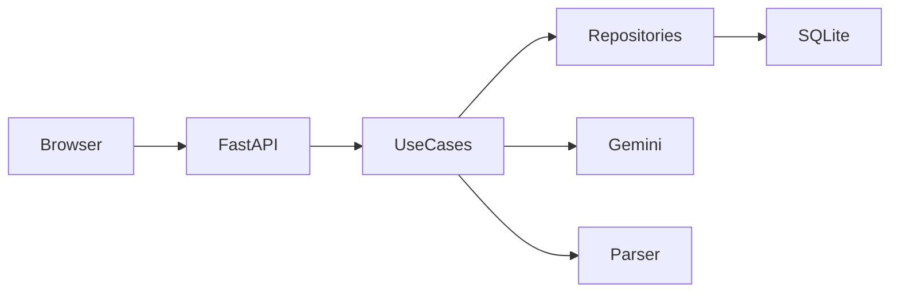
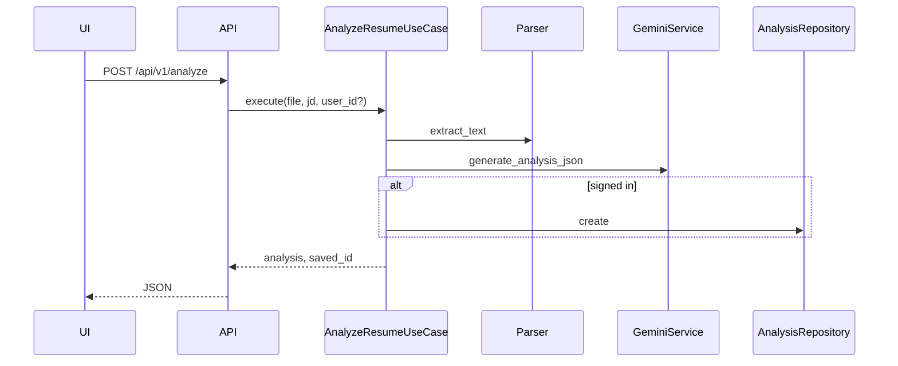
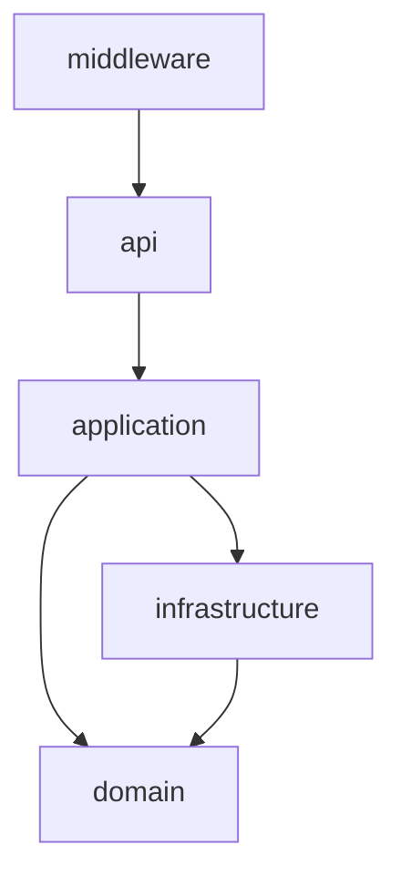
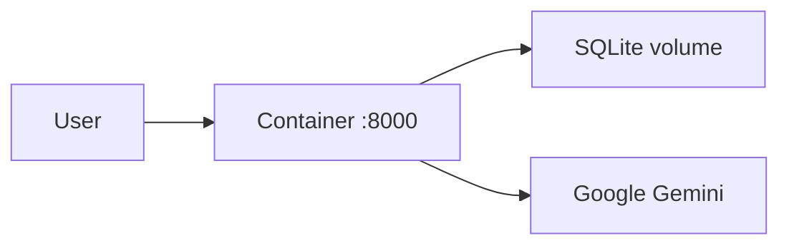

# Architecture Diagrams

## System architecture

```mermaid
flowchart LR
  Browser --> FastAPI
  FastAPI --> UseCases
  UseCases --> Repositories
  UseCases --> Gemini
  UseCases --> Parser
  Repositories --> SQLite
```

## Request flow — analyze

```mermaid
sequenceDiagram
  participant UI
  participant API
  participant UC as AnalyzeResumeUseCase
  participant Parser
  participant LLM as GeminiService
  participant Repo as AnalysisRepository
  UI->>API: POST /api/v1/analyze
  API->>UC: execute(file, jd, user_id?)
  UC->>Parser: extract_text
  UC->>LLM: generate_analysis_json
  alt signed in
    UC->>Repo: create
  end
  UC-->>API: analysis, saved_id
  API-->>UI: JSON
```

## Package diagram

```mermaid
flowchart TB
  api --> application
  application --> domain
  application --> infrastructure
  infrastructure --> domain
  middleware --> api
```

## Deployment

```mermaid
flowchart LR
  User --> DockerApp["Container :8000"]
  DockerApp --> Volume["SQLite volume"]
  DockerApp --> GeminiAPI["Google Gemini"]
```
